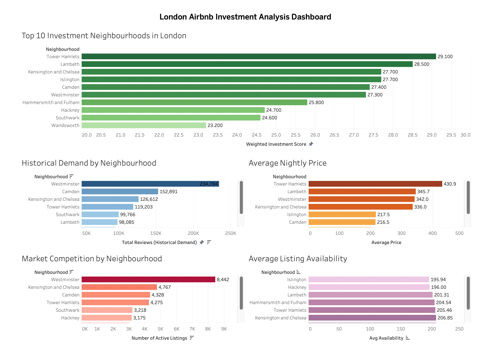

# 🏠 London Airbnb Investment Analysis


## 📖 Project Overview

This project analyzes Airbnb listings across London to identify the most attractive neighbourhoods for property investment. Using **Google BigQuery (SQL)** and **Tableau**, the project evaluates neighbourhood performance based on historical demand, average nightly price, market competition, and listing availability.

A weighted investment scoring model was developed to objectively rank neighbourhoods and provide data-driven investment recommendations for potential Airbnb investors.

---

## 🎯 Business Problem

Investors often rely on a single metric, such as price or demand, when selecting Airbnb properties. However, making investment decisions based on one factor can overlook important aspects such as market competition and occupancy potential.

This project develops a data-driven investment framework by evaluating multiple business metrics simultaneously to identify the most attractive Airbnb investment opportunities across London.

---

## 🎯 Project Objectives

The objectives of this project were to:

- Clean and validate Airbnb listing data using SQL.
- Analyze neighbourhood-level demand and pricing.
- Measure market competition and listing availability.
- Build a weighted investment scoring model.
- Visualize insights using Tableau.
- Provide actionable business recommendations for investors.

---

## 🛠️ Tools & Technologies

- **Google BigQuery** – Data storage, cleaning, validation, and analysis
- **SQL** – Data transformation, aggregation, CTEs, and window functions
- **Tableau** – Interactive dashboard and data visualization
- **GitHub** – Project documentation and version control

---

## 📂 Project Workflow

This project followed the **Google Data Analytics Process**:

1. **Ask** – Defined the business problem and investment objectives.
2. **Prepare** – Collected and explored the Airbnb London dataset.
3. **Process** – Cleaned, validated, and transformed the data using SQL in Google BigQuery.
4. **Analyze** – Examined demand, pricing, competition, and availability to identify investment opportunities.
5. **Share** – Designed an interactive Tableau dashboard to communicate insights.
6. **Act** – Developed business recommendations based on the analytical findings.

---

## 📊 Key Findings

- 🥇 **Tower Hamlets** achieved the highest weighted investment score.
- 📈 **Westminster** generated the highest historical demand but also had the highest market competition.
- 💷 **Entire Home/Apartment** listings showed the strongest balance between demand and revenue potential.
- ⭐ **Lambeth** and **Kensington & Chelsea** also demonstrated excellent investment opportunities.

---

## 📸 Dashboard Preview

```markdown

```
